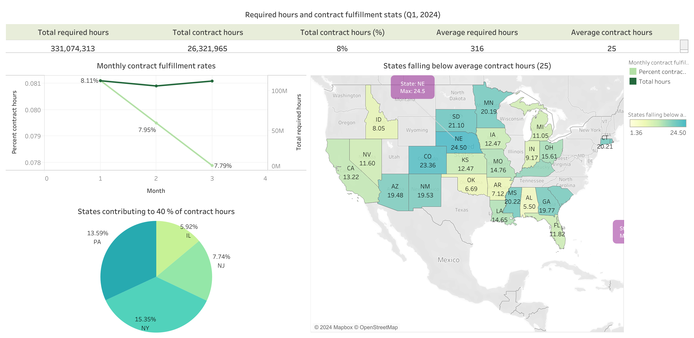

# Project Background

I analyzed the Payroll-Based Journal (PBJ) data from the Centers for Medicare & Medicaid Services (CMS) to evaluate staffing patterns in U.S. nursing homes. The goal is to provide data-driven recommendations to XYZ's sales leadership team, focusing on optimizing contract nursing fulfillment across key facilities in the first quarter of 2024.

Guided by XYZ's core values of Efficiency and Growth, this analysis explores the alignment between the total nursing hours required by nursing home facilities and the percentage of contract hours fulfilled by XYZ across various states.

Insights and recommendations are presented in the following key areas:

1. Overall staffing efficiency during Q1 2024
2. Regional and location-specific staffing gaps
3. High-demand locations with strong and weak performance
4. Role-specific staffing distribution

The SQL queries used to inspect and clean the data for this analysis can be found here [link].
Targeted SQL queries regarding various business questions can be found here [link].
A Tableau dashboard reporting overall staffing efficiency and trends can be found here.
Another Tableau dashboard reporting the other insights (2, 3, 4) can be found here. 

# Data structure & Initial checks

The dataset contains over 1 million records with 33 variables tracking daily logged hours across U.S. nursing facilities. To focus on total required and fulfilled contract hours, we can remove employee-specific hours and unnecessary temporal details.

### Constraints/ Validations:
-	Values in the hours columns should always be positive (>0)
-	Values in the hours columns should not accept nulls

# Executive summary

In Q1 2024, the total contract fulfillment rate across all regions was only 8%, with an average of 25 hours per contract against a requirement of 316 hours. Major states like New York, Florida, and California show high demand but low contract fulfillment, with certain counties like Los Angeles and Miami-Dade exhibiting significant gaps. Among roles, certified nursing assistants (CNAs) account for the highest average contract hours, while other critical roles, such as licensed practical nurses (LPNs) in administrative positions and nurse aides in training, have minimal contract coverage.

# Insights deep dive

### Overall staffing efficiency during 2024 Q1:

-	Overall contract fulfillment rate trends: The total contract fulfilment rate recorded in Q1 2024 is 8% with an average of 25 hours per while the required hours is at 316 hours. A closer look at the monthly contract fulfilment rates start from 8.11% in January and gradually, reduce to 7.79% in March.
-	States contributing to 40% of contract hours: States like New York, Pennsylvania, New Jersey, and Illinois as contributing the most to contracted hours, showing where the company is focusing its efforts or seeing higher engagement.
-	States falling short in meeting the required hours: Nearly half of the US states have contract hours below the average metric (25 hours). Nebraska with an average of 24.5 hours, Colorado with an average 23.36 hours, and so on. 5 underperforming states (Idaho, Oklahoma, Alabama, Arkansas, Indiana) have average less than 10.

### Regional and Location-specific staffing gaps:

-	High-demand, low-fulfilment states: New York, Florida, and California have high demand for nursing hours but low contract fulfilment (12.72%, 2.96%, 3.54%).
-	Counties with high demand but low fulfilment: Los Angeles (CA) and Miami-Dade (FL) have high total hours required but low contract fulfilment percentages (2.82% and 2.69%). 

### Locations with high requirement and performance:

-	States with high requirement hours: States like New York, Florida, Pennsylvania, California, Ohio has more than 20 million hours of requirement. 
-	Counties with high requirement hours: Counties like Los Angeles, Queens, Kings, Bronx have more than 3 million hours of requirement. 
-	Nursing homes with high contract fulfilment: Certain nursing homes in Pennsylvania, New York, Michigan, Florida recorded more than 50,000 contract hours in Q1 2024. 

### Role-specific staffing distribution:

-	High demand, low fulfilment roles: Roles like Certified nursing assistant, Licensed practical nurse, and Registered nurse have these respective average requirement hours and average contract hours ratio (177.7 : 14, 66.8 : 7, 36.2 : 3.4).
-	Underperforming roles: key roles like licensed practical nurses (LPNs) in administrative positions, RN director of nursing and nurse aides in training are only at 0.1 hours each.

# Recommendations

Based on the insights and findings above, we would recommend the Sales team head to consider the following:
-	Boost monthly fulfillment: Introduce incentives or extra resources at the start of each month to improve contract fulfillment. Address any operational issues that may be slowing monthly progress.
-	Expand in high engagement states: Strengthen partnerships in top states (NY, PA, NJ, IL) and apply successful strategies from these regions to underperforming states to lift engagement.
-	Focus on underperforming states: Target outreach and resources in the five lowest-performing states (ID, OK, AL, AR, IN). Look into barriers in these areas, and consider solutions like local hiring initiatives or flexible contract terms.
-	Target high demand states and counties: Ramp up recruiting in high-need counties (Los Angeles, CA, and Miami-Dade, FL) and shift resources from lower-demand areas if needed.
-	Address role specific Gaps: Increase recruitment for critical roles (CNAs, LPNs, RNs) and consider reassigning or upskilling administrative roles to improve contract performance in essential positions.

  

